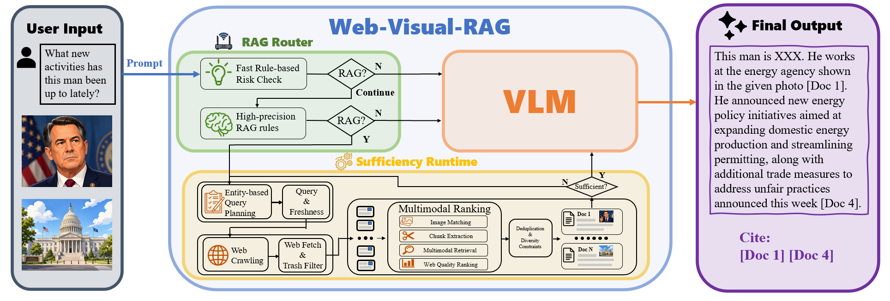

<div align="center">

# Web-Visual-RAG: Image-Guided Web Retrieval for Citation-Grounded Visual QA

</div>

An image-grounded web retrieval and question answering system for visual, time-sensitive, and evidence-heavy queries.
<p align="center">
  
</p>
`Web-Visual-RAG` takes one or more input images together with a natural-language question, generates an image-aware web search query with a VLM, retrieves candidate webpages, fetches real webpage bodies, reranks evidence with multimodal and quality-aware signals, and produces citation-grounded answers with an iterative sufficiency loop.

## I. Contents

- [Web-Visual-RAG: Image-Guided Web Retrieval for Citation-Grounded Visual QA](#web-visual-rag-image-guided-web-retrieval-for-citation-grounded-visual-qa)
  - [I. Contents](#i-contents)
  - [II. Overview](#ii-overview)
  - [III. Features](#iii-features)
  - [IV. Method](#iv-method)
  - [V. Project Structure](#v-project-structure)
  - [VI. Requirement](#vi-requirement)
  - [VII. Installation \& Quick Start](#vii-installation--quick-start)
    - [1. Configure Environment Variables](#1-configure-environment-variables)
    - [2. Install Dependencies](#2-install-dependencies)
    - [3. Start Local Retrieval Services](#3-start-local-retrieval-services)
    - [4. Run the CLI Pipeline](#4-run-the-cli-pipeline)
    - [5. Launch the Web UI](#5-launch-the-web-ui)
  - [VIII. CLI Usage](#viii-cli-usage)
  - [IX. Configuration](#ix-configuration)
    - [Chat / VLM](#chat--vlm)
    - [Web Search](#web-search)
    - [CLIP Server](#clip-server)
    - [Text Retrieval Server](#text-retrieval-server)
    - [Webpage Fetching and Caching](#webpage-fetching-and-caching)
    - [Evidence Ranking](#evidence-ranking)
  - [X. Evaluation](#x-evaluation)
  - [Acknowledgements](#acknowledgements)

## II. Overview

This repository contains our Computer Vision course project on theme 5: **Visual RAG QA**. The system is designed for questions where the image alone is not sufficient and the answer depends on external, up-to-date, or source-grounded evidence.

## III. Features

Compared with a plain image QA pipeline or a snippet-only web search baseline, this project emphasizes:

- **Image-aware entity-based search formulation**: a visual language model (VLM) generates a retrieval-oriented search query from the user image(s) and question, foucsing on useful entities based on the question and image(s).
- **Freshness-aware retrieval**: a separate freshness selection step is introduced to solve time-sensitive questions.
- **Real webpage fetching**: search results are expanded into full webpage bodies, titles, metadata, and page images.
- **Quality-aware evidence selection**: the system scores webpages by content quality, listing-page risk, image match, source reliability, and freshness.
- **Multimodal retrieval**: webpage chunks can be retrieved with text-only or multimodal scoring.
- **Iterative sufficiency loop**: if the current evidence is not enough, the system generates an additional query and retrieves more evidence.
- **Citation-grounded answers**: final responses are generated from structured `[Doc n]` evidence blocks and are required to cite the supporting sources, providing explainable results.
- **Multiple interfaces**: the project supports a CLI pipeline, a FastAPI backend, and a Vite + React frontend.

## IV. Method

The high-level pipeline is:

1. **Input**: receive one or more images and a question.
2. **RAG routing**: determine whether the question should use web retrieval or can be answered directly without RAG.
3. **Entity extraction**: if RAG is necessary, use a VLM to extract some candidate entities relative to the question.
4. **Query generation**: based on the information above, VLM generates web search query or quries.
5. **Freshness selection**: choose a retrieval freshness range for current or recent questions.
6. **Web search**: retrieve candidate URLs from the search API.
7. **Webpage fetching**: fetch real webpage bodies, page images, and metadata.
8. **Evidence construction**:
   - canonical URL deduplication
   - near-duplicate document suppression
   - page-image matching with CLIP
   - chunk extraction
   - multimodal retrieval
   - multi-signal evidence scoring
9. **Context aggregation**: organize selected evidence into structured `[Doc n]` blocks.
10. **Sufficiency check**: decide whether the current evidence is enough; if not, issue an additional retrieval query.
11. **Answer generation**: produce a grounded answer with citations.

## V. Project Structure

```text
CV-project/
├── src/rag_v1/
│   ├── apps/                  # CLI and API entrypoints
│   ├── clients/               # HTTP clients for local embedding services
│   ├── pipeline/              # Main RAG pipeline and session cache
│   ├── retrieval/             # Chunk extraction and retrieval helpers
│   ├── services/              # Web search, webpage fetching, VLM routing, image checking
│   ├── config.py              # Central configuration
│   └── prompts.py             # Prompt templates
├── frontend/                  # Vite + React web interface
├── tests/                     # Unit tests
├── val/                       # Benchmarks and validation
├── models/                    # Local model cache
├── cache/                     # Session-level retrieval cache
├── .cache/                    # Webpage fetch cache
├── pipeline.py                # Compatibility entrypoint
├── clip_server.py             # Compatibility entrypoint
└── text_retrieval_server.py   # Compatibility entrypoint
```

## VI. Requirement

The project uses a `src` layout and exposes the following console scripts:

- `rag-pipeline`
- `rag-clip-server`
- `rag-text-retrieval-server`
- `rag-web-api`

It requires:

- Python `>=3.10`
- Node.js for the frontend
- API access for:
  - a chat / VLM endpoint compatible with OpenAI Chat Completions
  - a web search API: `bocha` or `serpapi`

## VII. Installation & Quick Start

### 1. Configure Environment Variables

Copy `.env.example` to `.env` and fill in the required values:

```bash
cp .env.example .env
```

At minimum, you need:

- `DASHSCOPE_API_KEY` or `CHAT_API_KEY`
- `WEB_SEARCH_PROVIDER`
- the matching provider key: `BOCHA_API_KEY` or `SERPAPI_API_KEY`

The project loads `.env` automatically when importing `rag_v1`.

### 2. Install Dependencies

Install Python dependencies from the repository root:

```bash
pip install -r requirements.txt
```

If you want editable package installation:

```bash
pip install -e .
```

Install frontend dependencies:

```bash
cd frontend
npm install
```

### 3. Start Local Retrieval Services

The pipeline expects two local services:

- a CLIP embedding server
- a sentence-transformers text retrieval server

Start them from the project root:

```bash
rag-clip-server
```

```bash
rag-text-retrieval-server
```

The default service addresses:

- CLIP server: `http://127.0.0.1:8001`
- text retrieval server: `http://127.0.0.1:8002`

### 4. Run the CLI Pipeline

Example:

```bash
rag-pipeline \
  --question "What new activities has this man been up to lately?" \
  --images pictures/trump.jpg \
  --use-multimodal \
  --max-sufficiency-iterations 3 \
  --time
```

You can also compare against the direct no-RAG mode:

```bash
rag-pipeline \
  --question "What new activities has this man been up to lately?" \
  --images pictures/trump.jpg \
  --no-RAG
```

### 5. Launch the Web UI

Start the FastAPI backend:

```bash
rag-web-api
```

Or equivalently:

```bash
python -m uvicorn rag_v1.apps.web_api:app --host 127.0.0.1 --port 8010
```

Check backend health:

```bash
curl http://127.0.0.1:8010/health
```

Start the frontend:

```bash
cd frontend
npm run dev
```

Then open:

```text
http://127.0.0.1:5173
```

The frontend proxies `/api` requests to `http://127.0.0.1:8010`.

## VIII. CLI Usage

Main arguments for `rag-pipeline`:

- `--question`: question to answer
- `--images`: one or more local image paths
- `--use-multimodal`: enable multimodal chunk retrieval
- `--no-RAG` or `--no-rag`: bypass web retrieval and answer directly
- `--candidate-k`: number of search candidates to fetch before reranking
- `--top-k`: number of final chunks to keep
- `--top-n-images`: number of page images to keep per result
- `--chunk-size`: chunk size for webpage splitting
- `--chunks-per-doc`: maximum number of retrieved chunks per document
- `--max-sufficiency-iterations`: maximum number of iterative retrieval rounds
- `--debug`: print detailed intermediate output
- `--time`: print timing statistics
- `--simple-time`: print compact timing output, used together with `--time`

More examples:

```bash
rag-pipeline \
  --question "Who is this man?" \
  --images pictures/mjq.jpg \
  --use-multimodal \
  --debug \
  --time
```

```bash
rag-pipeline \
  --question "What new activities have these two people been up to lately?" \
  --images pictures/trump.jpg pictures/Curry.jpg \
  --use-multimodal \
  --debug \
  --max-sufficiency-iterations 3 \
  --time
```

## IX. Configuration

Configuration is centralized in [src/rag_v1/config.py](/d:/MarkdownFile/Computer_Vision/CV-project/src/rag_v1/config.py) and can be overridden with environment variables.

Important variables include:

### Chat / VLM

- `CHAT_API_KEY`
- `DASHSCOPE_API_KEY`
- `CHAT_API_BASE`
- `CHAT_MODEL`
- `CHAT_API_MODE`
- `CHAT_MAX_RETRIES`
- `CHAT_CONNECT_TIMEOUT`
- `CHAT_READ_TIMEOUT`

### Web Search

- `WEB_SEARCH_PROVIDER`
- `BOCHA_API_KEY`
- `BOCHA_API_URL`
- `BOCHA_TIMEOUT`
- `SERPAPI_API_KEY`
- `SERPAPI_API_URL`
- `SERPAPI_TIMEOUT`
- `SERPAPI_ENGINE`
- `SERPAPI_GOOGLE_DOMAIN`
- `SERPAPI_GL`
- `SERPAPI_HL`
- `SERPAPI_LOCATION`
- `SERPAPI_NO_CACHE`

### CLIP Server

- `CLIP_SERVER_HOST`
- `CLIP_SERVER_PORT`
- `CLIP_SERVER_REQUEST_TIMEOUT`
- `CLIP_MODEL_ID`
- `CLIP_LOCAL_MODEL_DIR`
- `CLIP_IMAGE_TIMEOUT`

### Text Retrieval Server

- `TEXT_RETRIEVAL_SERVER_HOST`
- `TEXT_RETRIEVAL_SERVER_PORT`
- `TEXT_RETRIEVAL_SERVER_REQUEST_TIMEOUT`
- `TEXT_RETRIEVAL_MODEL_ID`
- `TEXT_RETRIEVAL_LOCAL_MODEL_DIR`
- `TEXT_RETRIEVAL_BATCH_SIZE`

### Webpage Fetching and Caching

- `WEB_FETCH_ENABLED`
- `WEB_FETCH_TIMEOUT`
- `WEB_FETCH_MAX_RETRIES`
- `WEB_FETCH_CACHE_TTL_SECONDS`
- `WEB_FETCH_MAX_BYTES`
- `WEB_FETCH_MIN_TEXT_CHARS`
- `WEB_FETCH_CACHE_DIR`

### Evidence Ranking

- `IMAGE_MATCH_THRESHOLD`

## X. Evaluation

You can check our validation traces and results in `val/example_results`.
We run the following commands to get the results displayed in our report.
```bash
python val/eval_baseline.py --mode no_rag --trails 1 --model-id qwen3-vl-8b-instruct

python val/eval_baseline.py --mode no_rag --trails 1 --model-id qwen3-vl-plus-2025-12-19

python val/eval_baseline.py --mode full_rag --model-id qwen3-vl-8b-instruct --top-k 10 --candidate-k 30 --top-n-images 3 --chunk-size 256 --chunks-per-doc 5 --use-multimodal --multimodal-text-weight 0.7 --web-search-provider bocha

python val/eval_baseline.py --mode route_router --model-id qwen3-vl-30b-a3b-instruct --top-k 10 --candidate-k 30 --top-n-images 3 --chunk-size 256 --chunks-per-doc 5 --use-multimodal --multimodal-text-weight 0.7 --web-search-provider bocha
```

## Acknowledgements

This project was built as a Computer Vision course project and integrates ideas from visual reasoning, web retrieval, evidence-grounded generation, and multimodal reranking.

We thank the open-source ecosystems around:

- FastAPI
- Vite and React
- Hugging Face Transformers
- sentence-transformers
- CLIP

We also thank the following works that inspire our designs:

- **Wiki-LLaVA: Hierarchical Retrieval-Augmented Generation for Multimodal LLMs**  
  https://www.arxiv.org/abs/2404.15406

- **EchoSight: Advancing Visual-Language Models with Wiki Knowledge**  
  https://www.arxiv.org/abs/2407.12735

- **Large Language Models Know What is Key Visual Entity: An LLM-assisted Multimodal Retrieval for VQA**  
  https://aclanthology.org/2024.emnlp-main.613.pdf

- **RoRA-VLM: Robust Retrieval-Augmented Vision Language Models**  
  https://www.arxiv.org/abs/2410.08876

- **mR²AG: Multimodal Retrieval-Reflection-Augmented Generation for Knowledge-Based VQA**  
  https://www.arxiv.org/abs/2411.15041

- **Augmenting Multimodal LLMs with Self-Reflective Tokens for Knowledge-based Visual Question Answering (ReflectiVA)**  
  https://www.arxiv.org/abs/2411.16863

- **WikiSeeker: Rethinking the Role of Vision-Language Models in Knowledge-Based Visual Question Answering**  
  https://arxiv.org/abs/2604.05818
